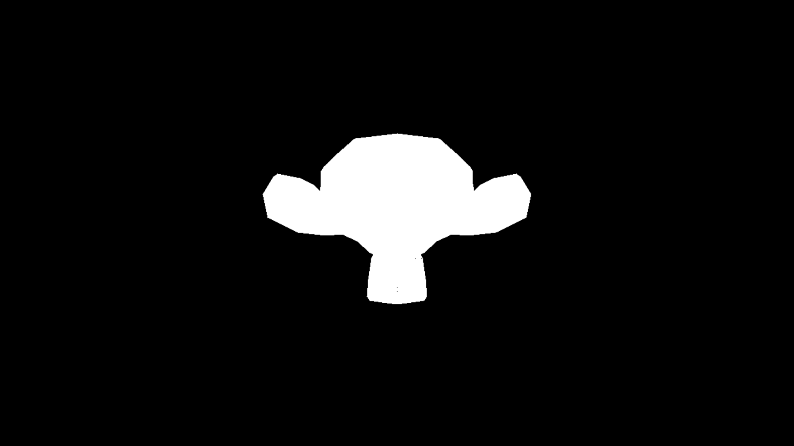

# Sparrow Rasterizer
This is the second (and improved) iteration of the first software rasterizer I have written.
I choose C++ instead of Rust because I wanted to grasp a better understanding of the language, as well as compare the two (how easy it is to have memory leaks, RAII vs Borrowing and so on).
This will include features the original did not (as well as a better written code), such as:
- Textures
- Actual lightning
- SIMD
- Multithreading

## Gallery

